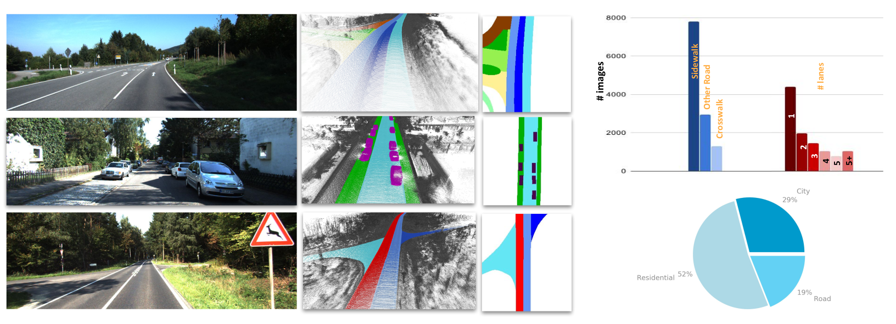

# AutoLay: Benchmarking Monocular Layout Estimation
#### Kaustubh Mani, N. Sai Shankar, [J. Krishna Murthy](https://krrish94.github.io), and [K. Madhava Krishna](http://robotics.iiit.ac.in)

## Abstract

In this paper, we tackle the problem of estimating the layout of a scene in bird’s eye view from monocular imagery.
Specifically, we target amodal layout estimation, i.e., we estimate semantic labels for parts of the scene that do not even project to the visible regime of the image. While prior approaches to amodal layout estimation focused on coarse attributes of a scene(roads, sidewalks), we shift our attention to generate amodal estimation for fine-grained atrributes such as lanes, crosswalks, vehicles, etc. To this end, we introduce AutoLay, a new dataset for amodal layout estimation in bird’s eye view. AutoLay includes precise annotations for (amodal) layouts for 32 sequences from the KITTI dataset. In addition to fine-grained attributes such as lanes, sidewalks, and vehicles, we also provide detailed semantic annotations for 3D pointclouds. To foster reproducibility and further research in this nascent area, we open-source implementations for several baselines and current art. Further, we propose VideoLayout, a real-time neural net architecture that leverages temporal information from monocular video, to produce more accurate and consistent layouts. VideoLayout achieves state-of-the-art performance on AutoLay, while running in real-time (18 fps).

## Dataset

    

We use 32 video sequences from the KITTI Raw dataset in AutoLay. We provide per-frame annotations
in perspective, orthographic (bird’s eye view), as well as in 3D. Of the 32 annotated sequences, 17 sequences-containing 7414 images—are used for training. The other 15 sequences—comprising 4438 images—form the test set. This makes for nearly 12K annotated images, across a distance of 9.5 Km, and a variety of urban scenarios (residential, urban, road). The semantic classes considered in this dataset are road, sidewalk, vehicle, crosswalk, and lane. Each lane segment is provided a unique id, which we classify further. The lane class is further classified as ego-lane and other lane. We also have an other road class for road areas that do not fall under any of the above categories.

**Sample dataset can be downloaded from [here](https://drive.google.com/file/d/1u7EQJEM9nmDeLuMd4AvcqllJUWOAQ3rS/view?usp=sharing).**

    

## Benchmark 

We provide a comprehensive benchmark of all the state-of-the-art methods for layout estimation on Autolay. 

    

## Results

### Road Layout Estimation

    

### Vehicle Layout Estimation

    

### Lane Layout Estimation

    

**Code for VideoLayout and other state-of-the-art layout estimation methods and the AutoLay dataset will be released on acceptance.**
